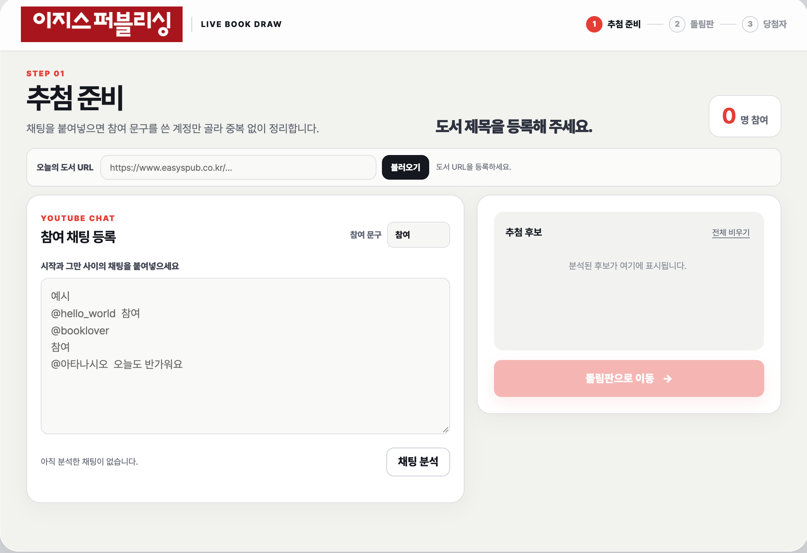
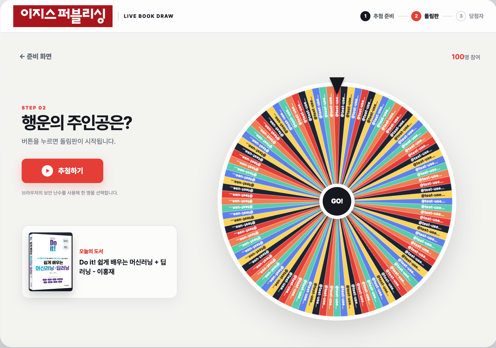
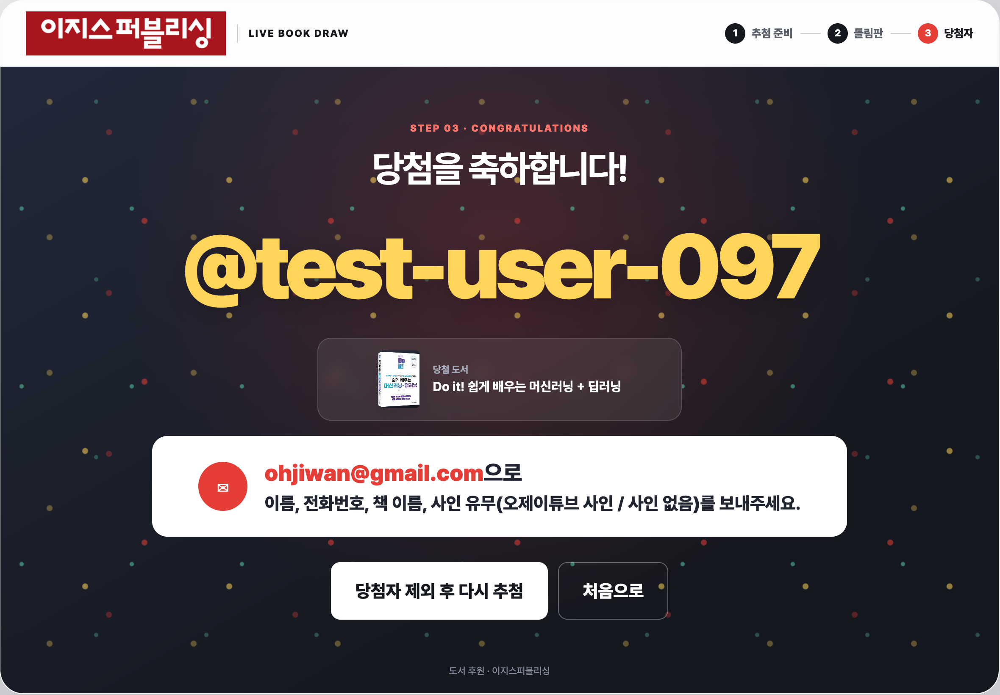

# 이지스퍼블리싱 도서 추첨

유튜브 라이브 채팅에서 참여자를 정리하고, 이지스퍼블리싱 도서를 등록한 뒤 돌림판으로 당첨자를 뽑는 방송용 웹 프로그램입니다. 외부 프레임워크나 패키지 없이 브라우저 표준 API와 Node.js만 사용합니다.

## 화면 미리보기

### 1. 추첨 준비



### 2. 돌림판



### 3. 당첨자



## Features

### 유튜브 채팅에서 참여 후보 추출

참여 문구 입력값을 기준으로 유튜브 라이브 채팅 원문을 분석합니다. 기본값은 `참여`이며, 문구가 메시지에 포함되어 있으면 후보로 인정합니다. 따라서 `참여합니다.`, `참여요`, `참여!!!!!`, `참여?`도 모두 처리합니다.

`=== 시작 ===`과 `=== 그만 ===` 또는 `=== 이상 ===` 사이의 내용만 분석할 수 있어, 방송 진행자가 추첨 시작·종료 구간을 명확히 나눌 수 있습니다. `@핸들 메시지`, 핸들과 메시지가 다음 줄에 있는 형식, 한 줄에 여러 핸들이 이어진 형식도 인식합니다.

### 복사본 정리와 중복 제거

복사 과정에서 섞이기 쉬운 빈 줄, 보이지 않는 문자, 제어 문자, `#3` 같은 표식은 무시합니다. 동일 핸들이 여러 차례 참여해도 한 번만 후보에 등록하며, 분석 완료 후에는 등록 인원과 제거한 중복 수를 함께 표시합니다.

후보는 개별 삭제하거나 한 번에 비울 수 있습니다. 후보 목록이 세로 320px보다 길어지면 목록 안에서만 스크롤되어 준비 화면의 크기를 유지합니다.

### 도서 URL 등록과 정보 추출

이지스퍼블리싱 도서 상세 페이지 URL을 입력하면 로컬 스크래핑 API가 도서 HTML을 읽고 제목, 저자, 설명, 표지를 등록합니다. 등록한 제목과 저자는 준비 화면 중앙, 돌림판 화면의 도서 카드, 당첨 화면의 당첨 도서 정보에 반영됩니다.

도서 페이지가 세션 쿠키를 요구하는 경우에도 로컬 서버가 쿠키를 유지해 다시 요청합니다. 추출 위치와 예외 처리는 [도서 URL 스크래핑](#도서-url-스크래핑)에서 확인할 수 있습니다.

### 돌림판 추첨과 재추첨

후보가 두 명 이상이면 돌림판으로 이동할 수 있습니다. 후보 수에 맞춰 캔버스 돌림판을 그리고, 브라우저의 보안 난수 API인 `crypto.getRandomValues()`로 당첨자를 선택합니다.

당첨 결과에서는 핸들, 당첨 도서, 안내 메일을 크게 표시합니다. `당첨자 제외 후 다시 추첨`을 누르면 직전 당첨자를 후보에서 제거하고 남은 후보로 즉시 다음 추첨을 진행합니다.

### 방송용 3단계 화면

준비 화면은 채팅 입력·도서 URL·후보 확인을 한곳에 배치합니다. 돌림판 화면은 추첨 버튼과 도서 카드, 큰 돌림판을 제공하며, 당첨 화면은 축하 배경과 연락 안내를 방송에서 읽기 쉬운 크기로 표시합니다.

데스크톱 방송 화면을 우선으로 구성했고, 화면이 부족한 경우에는 내용이 잘리지 않도록 자연스럽게 스크롤됩니다.

## 실행

Node.js 18 이상이 필요합니다. 별도 패키지 설치는 필요하지 않습니다.

```bash
npm run dev
```

브라우저에서 [http://localhost:4173](http://localhost:4173)을 엽니다.

도서 정보를 불러오는 로컬 API가 포함되어 있으므로, 도서 URL 스크래핑을 사용하려면 정적 파일을 직접 열지 말고 위 개발 서버 또는 아래 미리보기 서버로 실행해야 합니다.

## 사용 방법

1. 상단의 `오늘의 도서 URL`에 이지스퍼블리싱 도서 상세 페이지 주소를 붙여넣고 `불러오기`를 누릅니다.
2. 참여 문구를 정한 뒤 유튜브 채팅 원문을 입력합니다.
3. `채팅 분석`을 눌러 후보와 중복 제거 결과를 확인합니다. 후보 목록은 320px을 넘으면 목록 안에서 스크롤됩니다.
4. `돌림판으로 이동`에서 추첨을 시작합니다.
5. 당첨 화면에서 안내 문구를 확인하거나, 당첨자를 제외하고 다시 추첨합니다.

## 검증과 빌드

```bash
npm test
npm run build
npm run preview
```

- `npm test`: 채팅 파싱과 당첨자 제외 재추첨 규칙을 검사합니다. 100명의 후보, 중복, 복사 표식, 줄바꿈 없는 핸들을 포함한 시나리오도 검증합니다.
- `npm run build`: `src/`를 `dist/`로 복사합니다.
- `npm run preview`: `dist/`를 로컬 서버로 실행합니다. 도서 URL 스크래핑도 사용할 수 있습니다.

## 구조

```text
src/
├── index.html
├── styles/
│   └── main.css
└── scripts/
    ├── app.js                         # DOM 이벤트와 화면 흐름 연결
    ├── application/
    │   └── BookDrawService.js         # 후보·도서·추첨 유스케이스
    ├── domain/
    │   ├── book/Book.js               # 도서 모델과 표시 규칙
    │   ├── chat/ParticipantParser.js  # 채팅 정규화와 참여자 추출
    │   └── draw/Draw.js               # 추첨과 재추첨 규칙
    ├── infrastructure/
    │   └── EasyspubBookRepository.js  # 도서 페이지 HTTP/HTML 어댑터
    ├── presentation/
    │   └── WheelRenderer.js           # 캔버스 돌림판 렌더링
    └── testing/
        └── createTestChat.js          # 100명 채팅 테스트 데이터
scripts/
├── dev.mjs                            # 정적 파일·도서 스크래핑 로컬 서버
└── build.mjs                          # 배포 파일 생성
tests/
├── application/
└── domain/
```

도메인 규칙은 DOM과 HTTP 구현에 의존하지 않습니다. 화면은 `app.js`에서 애플리케이션 서비스를 호출하고, 도서 스크래핑은 인프라 어댑터에서 담당합니다.

## 도서 URL 스크래핑

로컬 서버의 `/api/book-page`는 `www.easyspub.co.kr` 도메인만 허용합니다. 이 서버는 사이트가 요구하는 세션 쿠키를 유지한 뒤 HTML을 받아오며, 다음 정보를 우선 추출합니다.

- 제목: `#BOOK_TITLE`, 없으면 `og:title`
- 저자: `.book_info dt`에서 `저자` 항목의 값
- 설명: `#BOOK_COMMENT`, 없으면 메타 설명
- 표지: `#BOOK_IMGURL`, 없으면 `og:image`

도서 스크래핑에는 인터넷 연결이 필요합니다. 후보와 추첨 결과는 서버나 브라우저 저장소에 보관하지 않고 현재 화면에서만 유지됩니다.
